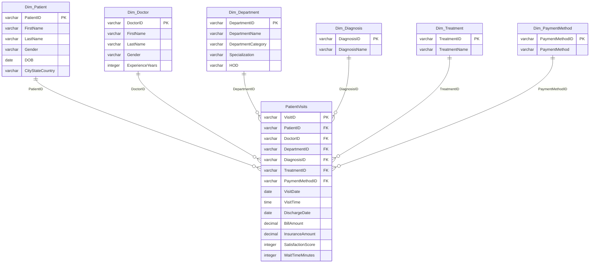

# Hospital Data Analysis (SQL)

## Project Overview

This project demonstrates core **SQL** skills through the analysis of hospital patient and operational data.

The project includes designing a relational database, loading and validating data, transforming data for analysis, and writing SQL queries that generate meaningful business insights. The analysis demonstrates SQL techniques commonly used by data analysts to answer operational and performance-related business questions.

---

## Business Problem

Hospitals generate large volumes of operational and patient data that can be used to improve efficiency, monitor performance, and support decision-making.

This project answers business questions related to patient volume, physician workload, department performance, and revenue using SQL.

---

## Tools Used

- SQL
- Relational Database
- SQL Queries
- Data Cleaning
- Data Transformation
- Data Analysis

---

## Project Objectives

### 1. Create and Populate a Relational Database

Design a relational database and populate it with hospital operational data.

**Deliverables**

- Database tables
- Primary and foreign key relationships
- Sample hospital data

---

### 2. Clean and Validate Imported Data

Prepare the imported data for analysis by identifying and correcting inconsistencies.

**Deliverables**

- Data validation
- Data cleaning
- Standardized values
- Improved data quality

---

### 3. Analyze Hospital Data

Write SQL queries to answer common operational and business questions.

**Deliverables**

- Patient analysis
- Department analysis
- Physician analysis
- Revenue analysis
- Admission trends

---

### 4. Demonstrate Advanced SQL Techniques

Use SQL features commonly expected in entry-level data analyst positions.

**Deliverables**

- Multi-table joins
- Window functions
- Common Table Expressions (CTEs)
- Aggregate calculations
- Ranking queries
- Data transformations

---

## SQL Concepts Demonstrated

- INNER JOIN
- Subqueries
- Common Table Expressions (CTEs)
- Aggregate Functions (`SUM`, `AVG`, `COUNT`)
- Window Functions
- Ranking Functions
- CASE Statements
- Date Functions
- Data Type Conversion (`CAST`, `CONVERT`)

---

## Business Questions Answered

This project demonstrates how SQL can answer important operational questions, including:

- What was the total revenue and number of visits for each department?
- For each doctor, how many distinct patients did they treat?
- For each department, what were the average satisfaction score and average wait times?
- Which doctors have the highest average satisfaction score (minimum 100 visits)?
- Rank departments based on their total revenue within each department category.

---


## Skills Demonstrated

- SQL Database Design
- Relational Database Concepts
- Data Cleaning
- Data Validation
- Data Transformation
- Data Analysis
- Business Reporting
- Query Optimization
- Analytical Thinking
- Problem Solving

---

## Repository Structure

```
hospital-data-analysis-sql/
│
├── README.md
├── sql/
│   ├── Hospital_Create_Tables.sql
│   ├── Hospital_Insert_PatientVisits_Data.sql
│   ├── Hospital_Insert_Patient_Doctors_Data.sql
│   ├── Hospital_Insert_Dept_Treatment_Diagnosis_PayMethod_Data.sql
│   ├── Hospital_Data_Cleaning.sql
│   └── Hospital_Data_Analysis.sql
│
└── images/
    ├── Hospital_Data_ERD.png
    ├── Revenue_rank_by_dept.jpg
    ├── Dr_highest_satisfaction_score.jpg
    ├── Satisfaction_score_by_dept.jpg
    ├── Patient_volume_per_dr.jpg
    ├── Revenue_visits_per_dept.jpg
```

---

## Database Structure

The project uses a relational database consisting of multiple related tables representing:

- Patients
- Patient Visits
- Physicians
- Departments
- Diagnoses
- Treatments
- Payment Methods



> **Note:** The physical implementation stores patient visit records in separate tables (`PatientVisits_2020_2021`, `PatientVisits_2022_2023`, `PatientVisits_2024`, and `PatientVisits_2025`) to organize historical data. For clarity, the ERD presents these as a single logical `PatientVisits` fact table because all tables share the same structure and relationships.


---


